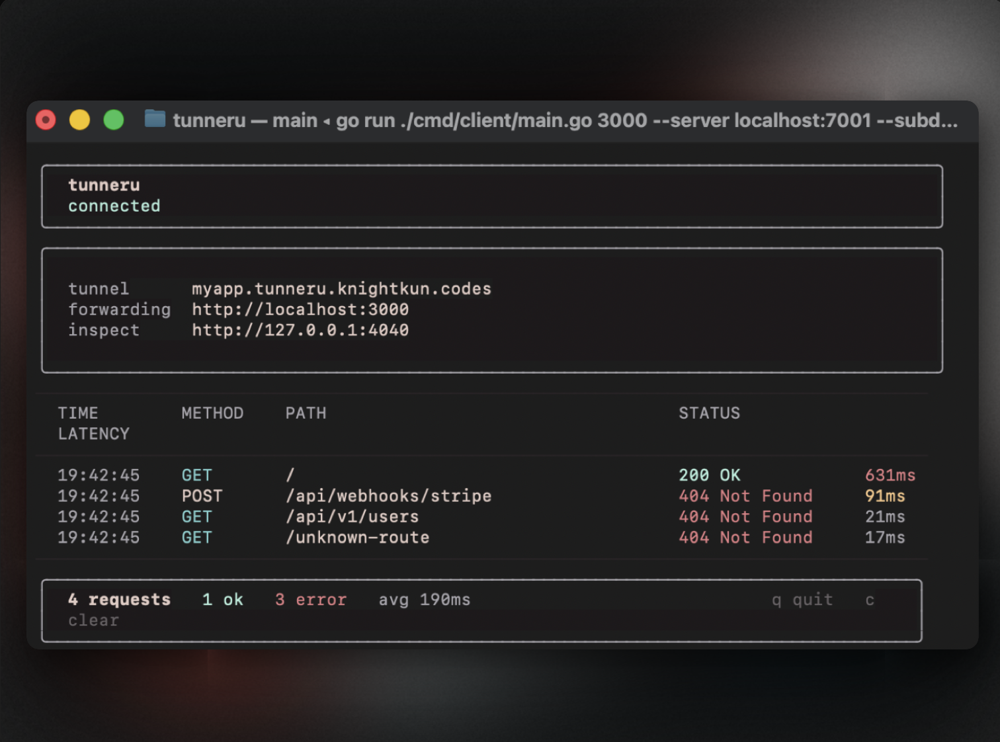
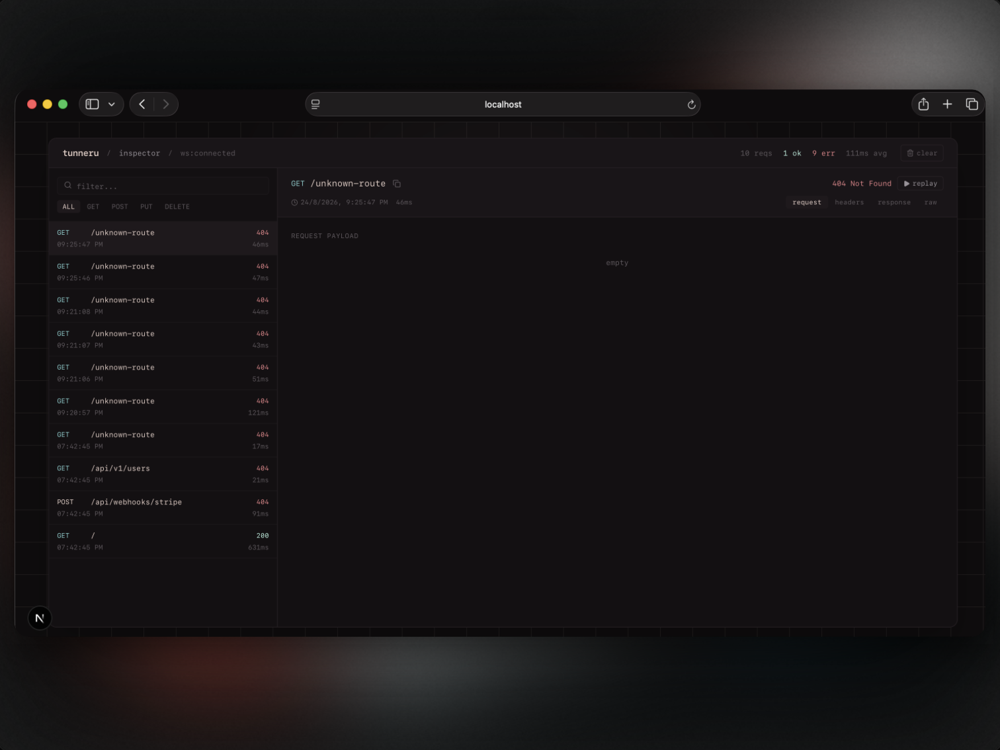

# tunneru

a lightweight zero-dependency tunneling engine, binary multiplexer, and real-time request inspection suite built in raw go from first principles. no ngrok accounts, no rate limits, no third-party cloud lock-in. expose localhost to the public internet instantly.

---

## contents

- [features](#features)
- [architecture](#architecture)
- [live terminal inspection and web dashboard](#live-terminal-inspection-and-web-dashboard)
  - [dashboard preview](#dashboard-preview)
  - [how to run the web dashboard](#how-to-run-the-web-dashboard)
  - [using the web dashboard](#using-the-web-dashboard)
- [quickstart and CLI reference](#quickstart-and-cli-reference)
  - [1. install the client](#1-install-the-client)
  - [2. expose a local port](#2-expose-a-local-port)
  - [3. custom subdomains and token auth](#3-custom-subdomains-and-token-auth)
  - [4. self-hosting the server](#4-self-hosting-the-server)
  - [5. CLI flags reference](#5-cli-flags-reference)
- [project structure](#project-structure)
- [how multiplexing works in tunneru](#how-multiplexing-works-in-tunneru)
- [acknowledgments](#acknowledgments)

---

## features

**custom 9-byte binary multiplexer**
- stream multiplexing over a single persistent TCP connection with zero external runtime dependencies
- ultra-compact 9-byte binary frame header (1B type, 4B stream id, 4B payload length)
- zero-allocation fast-path parsing with sub-millisecond frame dispatch latency

**terminal TUI and live telemetry**
- interactive terminal interface built with bubble tea, lipgloss, and bubbles
- real-time request log stream displaying HTTP method, request path, status codes, and latency timing
- per-session uptime counters, active stream metrics, and error rates right in your shell

**real-time web inspector and webhook replay**
- web dashboard built with next.js, react, and tailwind css listening on `localhost:4040`
- full HTTP request and response inspection with formatted JSON tree viewer, syntax highlighting, and raw header diffs
- instant 1-click webhook replay without re-triggering external providers (stripe, github, shopify)
- websocket event hub streaming live request payloads directly to the browser

**security and routing**
- claim predictable subdomains with `--subdomain`
- optional shared token authentication (`--auth-tokens` and `--auth-file`) to prevent unauthorized server access
- 100% private and self-hosted with no external telemetry or tracking

---

## architecture

```
                     +---------------------------------------+
                     |             public client             |
                     |         (curl, browser, stripe)       |
                     +-------------------+-------------------+
                                         |
                                         | HTTP / HTTPS
                                         v
                     +-------------------+-------------------+
                     |           tunneru-server              |
                     |   (:8080 proxy / :7001 control)       |
                     +-------------------+-------------------+
                                         |
                                         | 9-byte binary frames
                                         | persistent TCP stream
                                         v
                     +-------------------+-------------------+
                     |           tunneru client              |
                     |    (daemon + bubble tea live TUI)     |
                     +---------+-------------------+---------+
                               |                   |
            HTTP forwarding    |                   | WebSocket events
                               v                   v
                     +---------+---------+   +-----+-----------------+
                     |   local dev app   |   |   web inspector UI    |
                     | (localhost:3000)  |   |  (localhost:4040)     |
                     +-------------------+   +-----------------------+
```

---

## live terminal inspection and web dashboard

tunneru provides dual telemetry: an interactive bubble tea TUI in your terminal and a dedicated web dashboard on `localhost:4040`.

### dashboard preview



*live bubble tea terminal TUI displaying active tunnel status, forwarding target, and incoming request stream.*



*web inspector at localhost:4040 showing formatted json headers, payloads, and 1-click webhook replay.*

---

### how to run the web dashboard

#### 1. start a tunnel with inspection enabled
when you start a tunnel with tunneru, the web inspector starts automatically on port 4040:
```bash
tunneru 3000
```

#### 2. open the inspector in your browser
navigate to `http://localhost:4040` or click the inspector link inside the terminal TUI.

to run the standalone next.js web landing page locally:
```bash
cd web
npm install
npm run dev
```

open `http://localhost:3000` to view the interactive documentation and live simulator.

---

### using the web dashboard

- **request stream**: view incoming HTTP requests in real time with status code badges and latency counters.
- **json & header inspection**: inspect raw request headers, query parameters, and formatted json response bodies.
- **webhook replay**: click replay on any captured webhook (e.g. stripe payment event) to re-dispatch the payload to your local dev server instantly.
- **search & filter**: filter captured traffic by HTTP method (`GET`, `POST`, `PUT`, `DELETE`) or status code range.

---

## quickstart and CLI reference

### 1. install the client

install via the automated script:
```bash
curl -fsSL https://raw.githubusercontent.com/pranav718/tunneru/main/install.sh | sh
```

or install via go:
```bash
go install github.com/pranav718/tunneru/cmd/client@latest
```

or build from source:
```bash
git clone https://github.com/pranav718/tunneru.git
cd tunneru
make build
```

### 2. expose a local port

start your local web server (e.g. next.js, rails, fastapi, express) on port 3000, then expose it:
```bash
tunneru 3000
```

tunneru connects to the server, claims a public url (e.g. `https://myapp.tunneru.knightkun.codes`), and opens the live terminal TUI.

### 3. custom subdomains and token auth

request a specific subdomain:
```bash
tunneru 3000 -s myapp
```

authenticate with a private server:
```bash
tunneru 3000 -s myapp -t secrettoken123 --server tunneru.knightkun.codes:7001
```

disable the web inspector:
```bash
tunneru 3000 --inspect=false
```

### 4. self-hosting the server

run `tunneru-server` on any linux VPS (hetzner, digitalocean, fly.io, aws):

```bash
./tunneru-server \
  --domain tunneru.knightkun.codes \
  --control-addr :7001 \
  --proxy-addr :8080 \
  --auth-tokens secrettoken123,friendtoken456
```

or launch via docker compose:
```bash
docker compose up -d
```

### 5. CLI flags reference

#### client flags (`tunneru`)

| flag | type | default | description |
|---|---|---|---|
| `-s, --subdomain` | string | `""` | requested subdomain for public routing |
| `-t, --token` | string | `""` | authentication token for protected servers |
| `--server` | string | `"tunneru.knightkun.codes:7001"` | control server address |
| `--inspect` | bool | `true` | enable the local web inspector server |
| `--inspect-addr` | string | `":4040"` | listening address for the web inspector UI |

#### server flags (`tunneru-server`)

| flag | type | default | description |
|---|---|---|---|
| `--domain` | string | `"tunneru.knightkun.codes"` | base domain for tunnel routing |
| `--control-addr` | string | `":7001"` | listening address for control and multiplexing |
| `--proxy-addr` | string | `":8080"` | listening address for public HTTP ingress |
| `--auth-tokens` | string | `""` | comma-separated list of valid client tokens |
| `--auth-file` | string | `""` | path to JSON file mapping tokens to reserved subdomains |

---

## project structure

```
tunneru/
├── cmd/
│   ├── client/
│   │   └── main.go             # client CLI entry point and flag parsing
│   └── server/
│       └── main.go             # server CLI entry point and service bootstrap
├── internal/
│   ├── client/
│   │   ├── config.go           # client configuration struct and defaults
│   │   ├── forwarder.go        # local HTTP request dispatcher
│   │   └── tunnel.go           # control session and stream multiplexer client
│   ├── inspection/
│   │   ├── hub.go              # WebSocket event broadcaster for web UI
│   │   ├── server.go           # web inspector HTTP and replay server (:4040)
│   │   └── store.go            # in-memory circular ring buffer for requests
│   ├── mux/
│   │   ├── mux.go              # 9-byte binary multiplexer protocol encoder/decoder
│   │   ├── session.go          # full-duplex session manager and stream lifecycle
│   │   ├── stream.go           # concurrent bidirectional stream implementation
│   │   └── mux_test.go         # multiplexer unit and benchmark tests
│   ├── proto/
│   │   └── message.go          # control protocol wire formats and handshake types
│   ├── server/
│   │   ├── auth.go             # token verification and subdomain reservation
│   │   ├── control.go          # control connection listener and stream coordinator
│   │   ├── proxy.go            # public reverse proxy and host header router
│   │   ├── registry.go         # concurrent thread-safe client registry
│   │   └── router.go           # HTTP subdomain matcher and request proxy
│   └── tui/
│       ├── events.go           # bubble tea message types and event dispatch
│       ├── model.go            # bubble tea application state and update loop
│       ├── styles.go           # lipgloss color palettes and responsive layout
│       └── tui.go              # terminal TUI initialization and runner
├── web/
│   ├── app/
│   │   ├── globals.css         # global theme, dark mode, and marquee keyframes
│   │   ├── layout.tsx          # root html layout and OpenGraph metadata
│   │   ├── page.tsx            # landing page component layout
│   │   └── inspect/
│   │       └── page.tsx        # standalone web inspector application
│   ├── components/
│   │   ├── Header.tsx          # inspector header bar and live connection status
│   │   ├── JsonViewer.tsx      # interactive formatted json payload viewer
│   │   ├── RequestDetail.tsx   # request headers, query params, response viewer
│   │   ├── RequestList.tsx     # live request stream table with replay action
│   │   └── landing/
│   │       ├── Hero.tsx        # hero banner, value proposition, install copy pills
│   │       ├── Navbar.tsx      # navigation bar with 360-spin inspector action
│   │       ├── TextMarquee.tsx # infinite scrolling technical ticker
│   │       ├── TerminalPreview.tsx # live simulated bubble tea terminal component
│   │       ├── FeatureGrid.tsx # engineering highlights and spotlight cards
│   │       ├── HowItWorks.tsx  # protocol steps and 9-byte frame architecture
│   │       ├── Documentation.tsx # interactive guide, token auth, and CLI table
│   │       ├── Footer.tsx      # minimal lowercase footer with social links
│   │       ├── InteractiveLink.tsx # expanding underline and 360-spin arrow component
│   │       ├── SlideUpText.tsx # staggered slide-up typography reveal animation
│   │       ├── SpotlightCard.tsx # cursor tracking radial glow card wrapper
│   │       └── ParticleTunnel.tsx # 3D Three.js particle tunnel background
│   └── types/
│       └── index.ts            # typescript interface definitions
├── docker-compose.yml          # production server container orchestration
├── Dockerfile                  # multi-stage minimal scratch server container
├── Makefile                    # cross-platform build and test automation
├── install.sh                  # automated cross-platform binary installer
├── go.mod
└── go.sum
```

---

## how multiplexing works in tunneru

tunneru multiplexes hundreds of concurrent HTTP requests across a single persistent TCP socket using a custom 9-byte binary frame header:

```
+---------------+-----------------------------+-----------------------------+
| Type (1 Byte) |     Stream ID (4 Bytes)     |   Payload Length (4 Bytes)  |
|     uint8     |      uint32 big-endian      |      uint32 big-endian      |
+---------------+-----------------------------+-----------------------------+
|                                                                           |
|                        Payload Data (N Bytes)                             |
|                                                                           |
+---------------------------------------------------------------------------+
```

1. **frame encoding**: when public HTTP traffic arrives at the server proxy, the raw HTTP request is framed with a 1-byte type (`0x01` data, `0x02` ping, `0x04` close), a unique `uint32` stream id, and a `uint32` payload length.

2. **stream multiplexing**: frames from multiple concurrent incoming web requests are written to the single TCP control socket without blocking or head-of-line delays.

3. **client forwarding & dispatch**: the local client daemon decodes incoming frames by stream id, dispatches them to local `localhost:3000`, captures the local response, and frames the response back to the server.

4. **zero allocation fast-path**: header parsing uses fixed-size stack buffers with zero heap allocations during steady-state data streaming.

---

## acknowledgments

- [bubble tea](https://github.com/charmbracelet/bubbletea) and [lipgloss](https://github.com/charmbracelet/lipgloss) by charmbracelet for the terminal UI toolkit
- [lucide icons](https://lucide.dev) for interface iconography
- [three.js](https://threejs.org) for 3D visual canvas rendering
